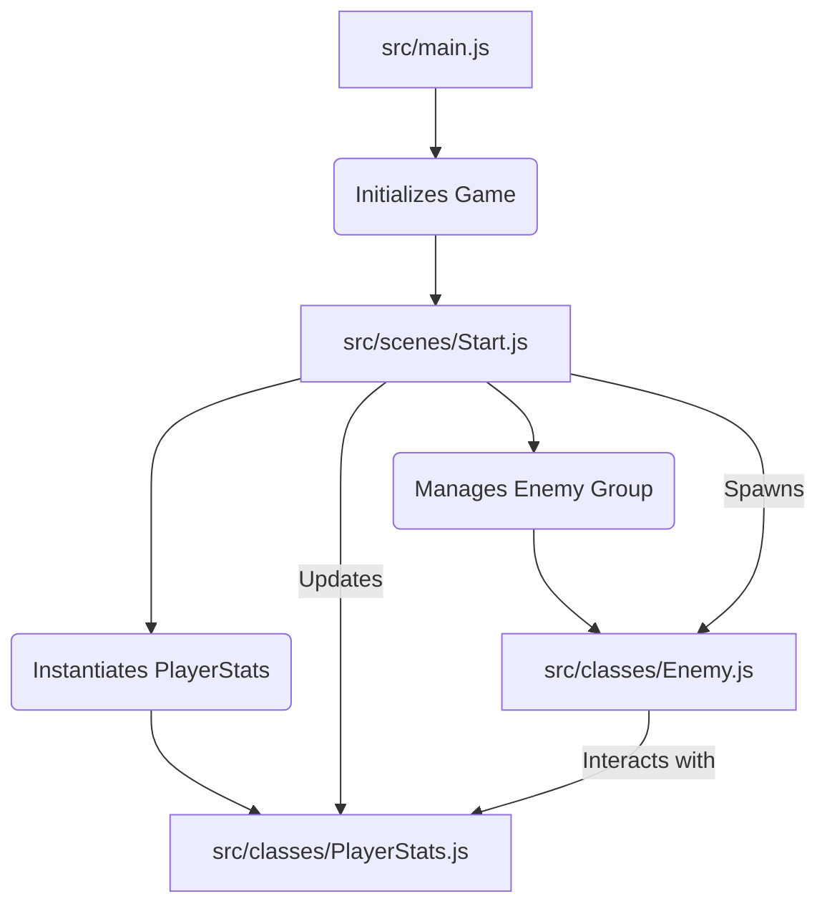

# Plan for Enemy and Player Systems Integration

## 1. Introduction

This document outlines a plan for integrating enemy spawning, tracking, and comprehensive player statistics (attack, health, shield, experience, and level) into the "NewRPG" game. The goal is to establish a robust system for managing combat encounters and player progression.

### 2. High-Level Overview

The proposed system will involve:

* A dedicated **Enemy Management System** responsible for spawning enemies, tracking their active count, and registering when they are defeated.
* An **Enemy Class/Prefab** to define enemy properties (health, attack, experience reward) and behavior.
* A **Player Statistics System** to manage the player's combat attributes (attack, health, shield) and progression metrics (experience, level).
* Mechanisms for **interaction** between the player and enemies, including combat resolution and experience gain upon enemy defeat.

### 3. Detailed Design

#### 3.1. Enemy Management System

* **Purpose:** To control the lifecycle of enemies within a scene, from spawning to tracking their defeat.
* **Implementation:**
  * **Enemy Group:** Utilize a Phaser `Group` or `Physics.Arcade.Group` within the `Start` scene (or a new dedicated `Game` scene) to manage all active enemy sprites. This allows for easy iteration, collision detection, and destruction.
  * **Spawning Logic:**
    * Implement a `spawnEnemy()` method that creates new enemy instances and adds them to the enemy group.
    * Consider different spawning patterns:
      * **Wave-based:** Spawn a fixed number of enemies per wave, with increasing difficulty.
      * **Time-based:** Spawn enemies at regular intervals.
      * **Event-driven:** Spawn enemies based on player actions or reaching certain game areas.
    * **Spawn Points:** Define specific coordinates or areas where enemies can appear.
  * **Tracking Killed Enemies:**
    * Maintain a counter for `enemiesKilledInWave` or `totalEnemiesKilled`.
    * When an enemy's health drops to zero, trigger its destruction and increment the counter.
    * This counter will be used for wave progression or achievement tracking.

#### 3.2. Enemy Class/Prefab

* **Purpose:** To define the common properties and behaviors of all enemies.
* **Implementation:**
  * Create a new JavaScript class (e.g., `Enemy.js`) that extends `Phaser.Physics.Arcade.Sprite` (if physics are needed) or `Phaser.GameObjects.Sprite`.
  * **Properties:**
    * `health`: Current health points.
    * `maxHealth`: Maximum health points.
    * `attackDamage`: Damage dealt to the player.
    * `experienceReward`: Amount of experience granted to the player upon defeat.
    * `speed`: Movement speed.
    * `type`: (Optional) Categorization for different enemy behaviors or assets.
  * **Methods:**
    * `takeDamage(amount)`: Reduces health, handles death if health <= 0.
    * `dealDamage()`: Returns `attackDamage`.
    * `update()`: (If extending `Phaser.GameObjects.Sprite`) Handles enemy movement, AI, etc.
  * **Asset Loading:** Enemies will require their own spritesheets or images, loaded in the `preload` method of the scene where they are used.

#### 3.3. Player Statistics System

* **Purpose:** To store and manage all player-related attributes and progression.
* **Implementation:**
  * Create a new JavaScript class (e.g., `PlayerStats.js`) or a simple object within the main game scene to hold player data.
  * **Properties:**
    * `attack`: Player's damage output.
    * `health`: Current health points.
    * `maxHealth`: Maximum health points.
    * `shield`: Current shield points (absorbs damage before health).
    * `maxShield`: Maximum shield points.
    * `experience`: Current experience points.
    * `level`: Current player level.
    * `experienceToNextLevel`: Experience required to reach the next level.
  * **Methods:**
    * `takeDamage(amount)`: Reduces shield first, then health.
    * `gainExperience(amount)`: Adds experience, checks for level-up.
    * `levelUp()`: Increments level, updates `maxHealth`, `maxShield`, `attack`, and `experienceToNextLevel`.
    * `heal(amount)`: Restores health.
    * `rechargeShield(amount)`: Restores shield.

### 4. Integration Points

* **Scene (`Start.js` or new `Game.js`):**
  * Instantiate the `PlayerStats` object.
  * Create and manage the `Enemy` group.
  * Implement collision detection between player attacks and enemies, and between enemies and the player.
  * Call `enemy.takeDamage()` when hit by player.
  * Call `playerStats.gainExperience()` when an enemy is defeated.
  * Call `playerStats.takeDamage()` when hit by an enemy.
* **Player Input:**
  * Modify player input handling to trigger attacks.
* **UI (Future Consideration):**
  * Display player health, shield, experience, and level on a HUD.

### 5. Code Structure Diagram

### 6. Conclusion

This plan provides a structured approach to implementing enemy spawning, tracking, and comprehensive player statistics. By breaking down the functionality into modular components, we can ensure a scalable and maintainable game system.
